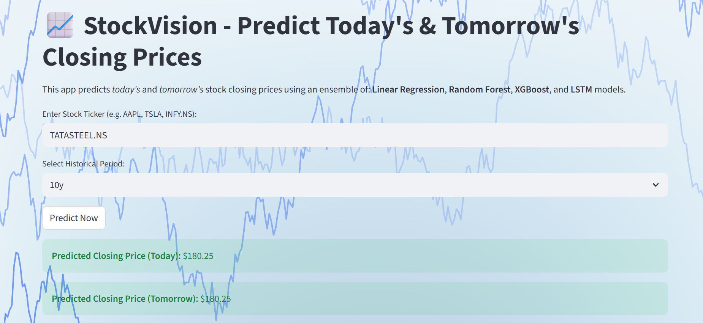

# 📈 StockVision

A Streamlit-based web app that predicts **today's** and **tomorrow's** stock closing prices using an ensemble of:
- Linear Regression  
- Random Forest  
- XGBoost  
- LSTM (Long Short-Term Memory)

## 🚀 Features
- Predicts today and tomorrow’s closing prices
- Real-time data fetched using Yahoo Finance
- Beautiful UI with interactive graph and live metrics
- Supports multiple time periods (1y, 3y, 5y, 10y)

## 🧠 Tech Stack
- Python
- Streamlit
- TensorFlow / Keras
- scikit-learn
- XGBoost
- yfinance

## 🖼️ Preview


## 🕹️ Run Locally
```bash
pip install -r requirements.txt
streamlit run app.py
